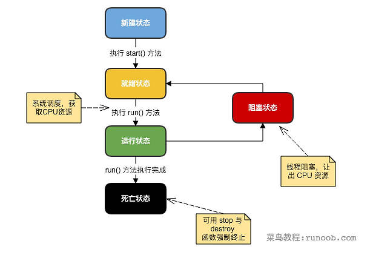
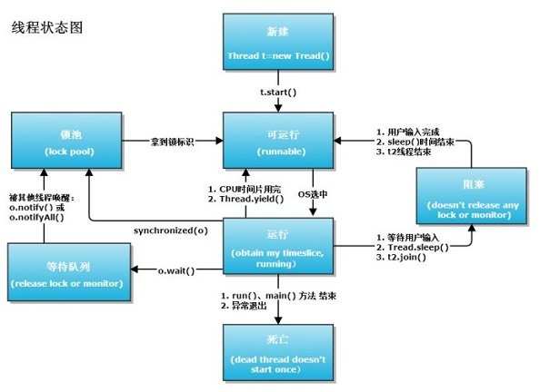

# Thread 通信

[线程通信与进程通信的区别](https://www.cnblogs.com/xh0102/p/5710074.html)
通过这篇文章的学习以及一些基本线程通信[demo分析](http://www.importnew.com/26850.html)
，就证明了一件事情，多线程之间和进程通信并不完全一致，多线程之间关注的更多的是:

* 锁                    synchronized
* 信号机制(signal)      volatile  wait和notify（好像并不准确）
* 信号量机制(Semaphore) Semaphore CountDownLatch  CyclicBarrier
* sleep wait yield join 几者之间的关系倒是可以通过下图说清楚，但是这个算线程通信的哪一块啊。

Thread state 生命周期图片 [出处](https://www.zhihu.com/question/23328075)

第一张图 简化阻塞部分

第二章图 细化阻塞部分

生命周期分解[分析](http://www.runoob.com/java/java-multithreading.html)

* 新建状态:使用 new 关键字和 Thread 类或其子类建立一个线程对象后，该线程对象就处于新建状态。它保持这个状态直到程序 start() 这个线程。
* 就绪状态:当线程对象调用了start()方法之后，该线程就进入就绪状态。就绪状态的线程处于就绪队列中，要等待JVM里线程调度器的调度。
* 运行状态:如果就绪状态的线程获取 CPU 资源，就可以执行 run()，此时线程便处于运行状态。处于运行状态的线程最为复杂，它可以变为阻塞状态、就绪状态和死亡状态。
* 阻塞状态:    如果一个线程执行了sleep（睡眠）、suspend（挂起）等方法，失去所占用资源之后，该线程就从运行状态进入阻塞状态。在睡眠时间已到或获得设备资源后可以重新进入就绪状态。可以分为三种：
  * 等待阻塞：运行状态中的线程执行 wait() 方法，使线程进入到等待阻塞状态。
  * 同步阻塞：线程在获取 synchronized 同步锁失败(因为同步锁被其他线程占用)。
  * 其他阻塞：通过调用线程的 sleep() 或 join() 发出了 I/O 请求时，线程就会进入到阻塞状态。当sleep() 状态超时，join() 等待线程终止或超时，或者 I/O 处理完毕，线程重新转入就绪状态。
* 死亡状态:一个运行状态的线程完成任务或者其他终止条件发生时，该线程就切换到终止状态。

## sleep、yield 、join、wait/notify

[参考](https://www.cnblogs.com/huajiezh/p/5868681.html)
sleep 不会释放锁，为静态方法可以在任何地方被调用,只会锁定当前线程

wait  会释放锁，但是只能同步方法和同步代码块中使用

yield 暂停，只是将当前线程重新回到可执行状态

join 等待改线程终止

## Semaphore 、CountDownLatch 和 CyclicBarrier

以下3者对比 看这篇[文章](https://blog.csdn.net/vernonzheng/article/details/8280032)

Semaphore信号量机制，acquire获取许可，release释放

CountDownLatch 设置初始值，每次减一，到0开始，简易demo看Test3
await开始等待，countDown不断计数,达到条件

1. [基本介绍和场景分析](http://www.importnew.com/15731.html)
2. [1.8源码分析](https://www.cnblogs.com/leesf456/p/5406191.html)

CyclicBarrier 到达某个屏障，等待一起执行，简易demo看Test4
