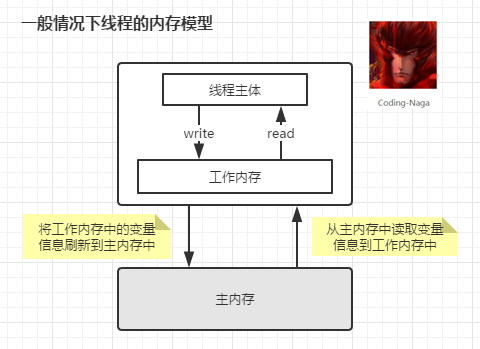
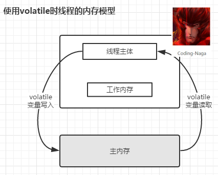

# volatile

**整篇未能涉及 volatile 中的顺序性的解析和分析，以后补充**

java中volatile可以认为是一种程度较轻的synchronized，实现采用"内存屏障"
* volatile      可见性          顺序性（禁止指令重排） *不保证原子性*
* synchronized  可见性和原子性   顺序性（两者都不确定,happens-before原则）

正确使用场景条件：
* 对变量的写操作不依赖于当前值
* 该变量没有包含在具有其他变量的不变式中 （例如 “start <=end”）

第一条举例不能用作线程安全计数器(x++等)，其中涉及读取-修改-写入，需要保证原子性

实践场景：
1. 状态标志
2. 一次性安全发布（one-time safe publication） 不懂 不懂，不懂。。。
3. 独立观察（independent observation）
4. “volatile bean” 模式                      不懂 不懂 不懂
5. 开销较低的读－写锁策略  （限制了很多条件，只实用于读很高，写少的操作）

案例一形成原因分析：

以上知识总结主要来自参考1，3 4是对1的补充，以及修正，或者更好的理解，
2是对1的实践场景1解释，以及对java的内存模型已经可见性的分析。

## 顺序性对可见性的影响？

为什么这里要分析这个顺序问题，因为不同的顺序会导致，产生不同的可见性

### happens-before原则
规定两个操作不满足happens-before原则的代码，就不保证可见性,规则如下:
1. 同一个线程中的，前面的操作 happens-before 后续的操作
2. 监视器上的解锁操作 happen-before 其后续的加锁操作  （sychronized原则）
3. 对volatile变量的写操作 happen-before 后续的读操作 （volatile原则）
4. 线程的start() 方法 happen-before 该线程所有的后续操作 （线程启动原则）
5. 线程所有的操作 happen-before 其他线程在该线程上调用 join 返回成功后的操作。
6. 如果 a happen-before b，b happen-before c，则a happen-before c （传递性）
7. 好像并不是只有这些。。

我的理解是action之间操作满足上面的条件的情况下，可以理解满足以上顺序，能够保证可见性。

以上原则[出处](http://www.importnew.com/23520.html)但是我一脸懵，这6条原则到底怎么生效。
让后看了通俗一点的解释[通俗解释](http://ifeve.com/easy-happens-before/)，一些其他地方[demo](https://toutiao.io/posts/377232/app_preview)，
[死磕happens-before（例子并不算好）](http://www.importnew.com/23519.html)

参考出处：
1. [正确使用 volatile 变量](https://www.ibm.com/developerworks/cn/java/j-jtp06197.html)
2. [volatile可见性和内存实例图](https://blog.csdn.net/lemon_tree12138/article/details/51062421)
3. [对参考1的拓展和理解](https://blog.csdn.net/vking_wang/article/details/9982709)
4. [单例模式 双重检查加锁](https://blog.csdn.net/vking_wang/article/details/8708520)
