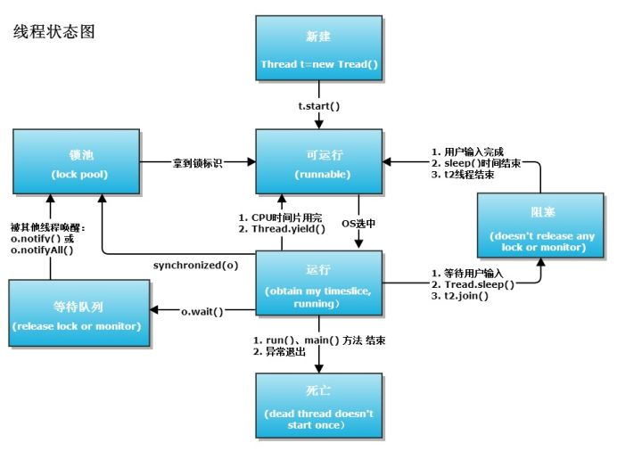

# Thread communication

基本案例demo[出处](http://www.importnew.com/26850.html)

Thread state 图片[出处](https://www.zhihu.com/question/23328075) 

### sleep 、wait 、 yield、join
sleep 不会释放锁，为静态方法可以在任何地方被调用,只会锁定当前线程

wait  会释放锁，但是只能同步方法和同步代码块中使用

yield 暂停

join 等待改线程终止
