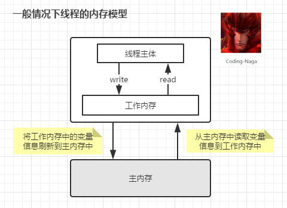
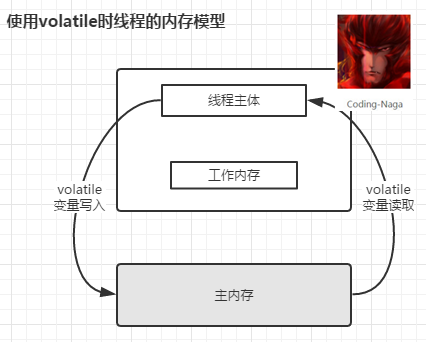

# volatile

**整篇未能涉及 volatile 中的顺序性的解析和分析，以后补充**

java中volatile可以认为是一种程度较轻的synchronized
* volatile      可见性           顺序性（禁止指令重排）
* synchronized  可见性和原子性   顺序性（两者都不确定,happened-before原则）

正确使用场景条件：
* 对变量的写操作不依赖于当前值
* 该变量没有包含在具有其他变量的不变式中 （例如 “start <=end”）

第一条举例不能用作线程安全计数器(x++等)，其中涉及读取-修改-写入，需要保证原子性

实践场景：
1. 状态标志
2. 一次性安全发布（one-time safe publication） 不懂 不懂，不懂。。。
3. 独立观察（independent observation）
4. “volatile bean” 模式                      不懂 不懂 不懂
5. 开销较低的读－写锁策略  （限制了很多条件，只实用于读很高，写少的操作）

案例一形成原因分析：

主体来自参考1，3 4是对1的补充，以及修正，或者更好的理解，
2是对1的实践场景1解释，以及对java的内存模型已经可见性的分析。

参考出处：
1. [正确使用 volatile 变量](https://www.ibm.com/developerworks/cn/java/j-jtp06197.html)
2. [volatile可见性和内存实例图](https://blog.csdn.net/lemon_tree12138/article/details/51062421)
3. [对参考1的拓展和理解](https://blog.csdn.net/vking_wang/article/details/9982709)
4. [单例模式 双重检查加锁](https://blog.csdn.net/vking_wang/article/details/8708520)