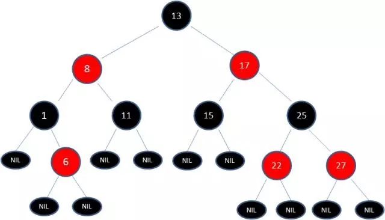

# 树理解

二叉查找树（BST）具备什么特性呢？
1. 左子树上所有节点的值均小于或等于它的根节点的值
2. 右子树上所有节点的值均大于或等于它的根节点的值
3. 左、右子树也分别为二叉排序树
优点：**完全平均分配时**，查找的最大次数为树的深度
缺点：不平均平情况下，会编程线性操作，左右节点偏差过大的，后如果又插入大量的两者之间的数字，会造成树节点强烈的分配不均匀

红黑树是一种自平衡的二叉查找树。除了树的基本特性以为还有：
1. 节点是红色或黑色。
2. 根节点是黑色。
3. 每个叶子节点都是黑色的空节点（NIL节点）。
4. 每个红色节点的两个子节点都是黑色。(从每个叶子到根的所有路径上不能有两个连续的红色节点)
5. 从任一节点到其每个叶子的所有路径都包含相同数目的黑色节点。

以上5点需要重点注意，为了时刻匹配以上5个准则，需要不停 **变色**，**左/右旋转**

参考：
1. [漫画图解红黑树](https://mp.weixin.qq.com/s?__biz=MzIxMjE5MTE1Nw==&mid=2653191832&idx=1&sn=12017161025495c6914b5ab9397baa59&chksm=8c990c42bbee8554ba02eb83d839123bd3bead6ffc736111456ea77367a3df75750cf88016e0&scene=21#wechat_redirect)